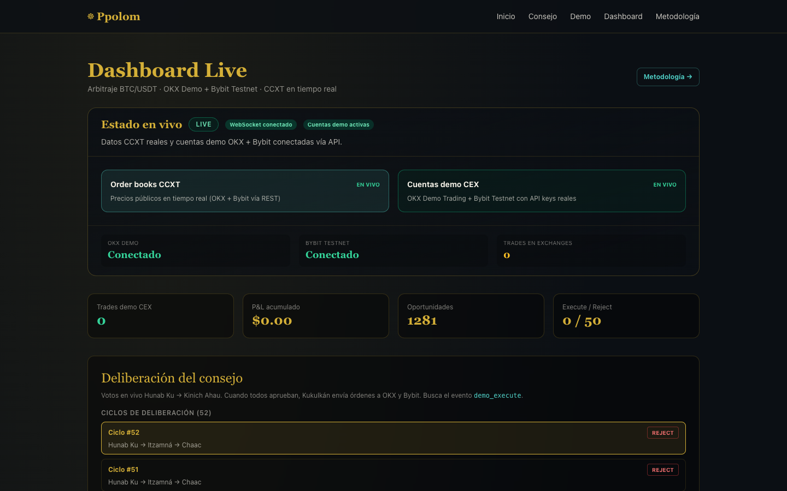
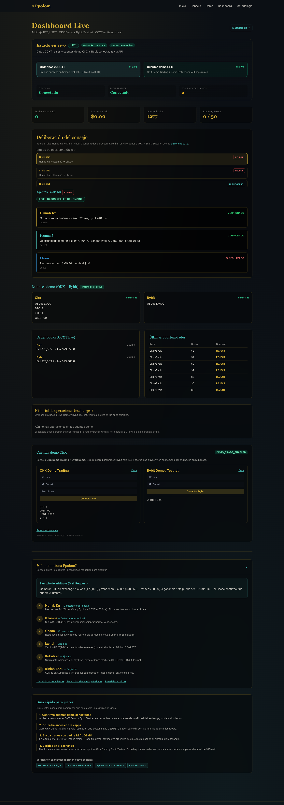
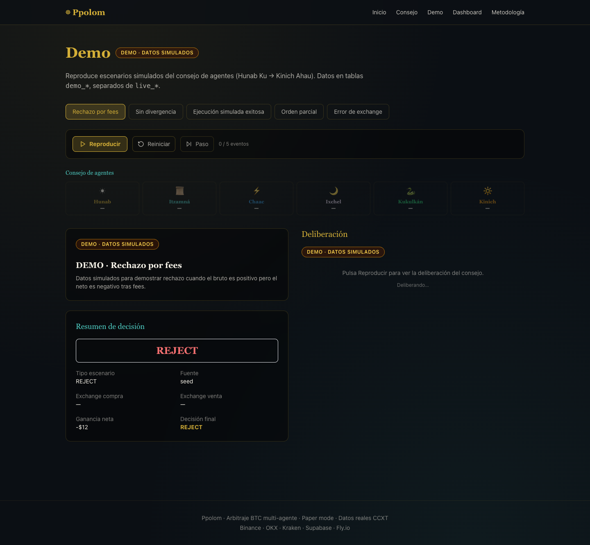
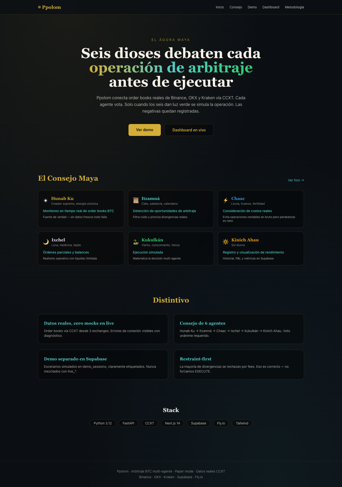

# Ppolom

**Seis agentes mayas debaten cada oportunidad de arbitraje BTC/USDT antes de simular la ejecución.**

Live demo · [Consejo](https://ppolom-web.fly.dev/council) · [Demo](https://ppolom-web.fly.dev/demo) · [Dashboard](https://ppolom-web.fly.dev/dashboard) · [Metodología](https://ppolom-web.fly.dev/methodology)

> **Paper mode + cuentas demo CEX.** Order books reales vía CCXT (OKX + Bybit en producción; también soporta Binance, Kraken). Ejecución simulada interna y, opcionalmente, órdenes reales en **OKX Demo** + **Bybit Testnet** cuando `DEMO_TRADE_ENABLED=true`. Demo en tablas `demo_*` claramente etiquetadas, separadas de `live_*` en Supabase.

### URLs en producción

| Servicio | URL |
|----------|-----|
| Web | https://ppolom-web.fly.dev |
| Engine API | https://ppolom-engine.fly.dev |
| Dashboard live | https://ppolom-web.fly.dev/dashboard |
| Health check | https://ppolom-engine.fly.dev/health |

---

## Capturas de pantalla

### Dashboard live — deliberación del consejo y cuentas demo



Vista completa del dashboard: panel de verificación (OKX Demo + Bybit Testnet conectados), métricas en tiempo real, deliberación Hunab Ku → Kinich Ahau y historial de operaciones en exchanges.



### Demo — escenarios etiquetados (replay)



### Inicio — Consejo Maya



---

## Qué es (60 segundos)

Ppolom es un bot de arbitraje cross-exchange donde **seis agentes** — Hunab Ku, Itzamná, Chaac, Ixchel, Kukulkán y Kinich Ahau — evalúan cada divergencia de precio. Solo cuando **todos votan positivo** se simula la operación (y, si hay keys demo, se envían órdenes reales a OKX/Bybit). La mayoría de divergencias reales se rechazan por fees: eso es correcto (restraint-first).

| Agente | Rol |
|--------|-----|
| **Hunab Ku** | Monitoreo order books (CCXT) |
| **Itzamná** | Detección ask &lt; bid |
| **Chaac** | Costos netos (fees + slippage + retiro) |
| **Ixchel** | Liquidez parcial + balances demo |
| **Kukulkán** | Ejecución simulada + demo CEX (OKX/Bybit) |
| **Kinich Ahau** | Registro Supabase + métricas |

---

## Arquitectura

```
┌─────────────────┐     REST/WS      ┌──────────────────┐
│  Next.js (web)  │ ◄──────────────► │ FastAPI (engine) │
│  Fly.io :3000   │                  │ Fly.io :8000     │
└────────┬────────┘                  └────────┬─────────┘
         │                                    │
         │         Supabase                   │ CCXT
         └──────────────┬─────────────────────┘
                        │
              live_*  (datos reales)
              demo_*  (simulados, etiquetados)
                        │
              OKX Demo + Bybit Testnet (API keys demo)
```

**Stack:** Python 3.12 · FastAPI · CCXT · Next.js 14 · Supabase · Fly.io · Tailwind · Zod · Jest

**Exchanges:** Binance · OKX · Kraken (3 vías para maximizar divergencias reales)

**Producción actual:** OKX + Bybit (demo/testnet) — Binance bloqueado geo en Fly US; engine desplegado en región **AMS** (Amsterdam).

---

## Quick start

### Requisitos

- Python **3.12**
- Node.js 20+ y **pnpm**
- Cuenta [Supabase](https://supabase.com)
- (Opcional) API keys **OKX Demo Trading** y **Bybit Testnet** para órdenes reales demo

### 1. Supabase

1. Crea un proyecto en [supabase.com](https://supabase.com)
2. Ejecuta en el SQL Editor:
   - `supabase/migrations/001_initial.sql`
   - `supabase/migrations/002_trade_execution_details.sql`
3. Copia URL + keys a `.env`

### 2. Variables de entorno

```bash
cp .env.example .env
# Edita SUPABASE_*, EXCHANGE_A/B, y opcionalmente:
# OKX_DEMO_API_KEY, OKX_DEMO_API_SECRET, OKX_DEMO_PASSWORD
# BYBIT_DEMO_API_KEY, BYBIT_DEMO_API_SECRET, BYBIT_DEMO_USE_TESTNET=true
# DEMO_TRADE_ENABLED=true
```

### 3. Engine

```bash
cd engine
python3.12 -m venv .venv && source .venv/bin/activate
pip install -r requirements.txt
PYTHONPATH=. uvicorn app.main:app --reload --port 8000
```

> Usa Python **3.12** (3.14 no compila pydantic-core localmente). En producción Fly usa la imagen `python:3.12-slim`.

Verificar keys demo (opcional):

```bash
cd engine
PYTHONPATH=. python scripts/test_demo_keys.py
```

### 4. Seed demo (tablas demo_* separadas)

```bash
cd engine
PYTHONPATH=. python scripts/seed_demo.py
```

### 5. Web

Run this in an isolated Dev Container / Docker / separate folder first.

```bash
cd web
pnpm install
pnpm dev
# http://localhost:3000
# http://localhost:3000/dashboard
```

Asegúrate de que `.env` tenga:

```bash
NEXT_PUBLIC_ENGINE_URL=http://localhost:8000
NEXT_PUBLIC_ENGINE_WS=ws://localhost:8000/ws
```

### 6. Tests

```bash
cd engine && PYTHONPATH=. pytest tests/
cd web && pnpm test
```

### 7. Regenerar capturas de pantalla (opcional)

```bash
npx playwright@1.49.1 screenshot --viewport-size=1440,900 --wait-for-timeout=5000 --full-page \
  https://ppolom-web.fly.dev/dashboard docs/screenshots/dashboard-full.png
```

---

## Deploy Fly.io

```bash
# Engine
cd engine && fly launch --no-deploy
fly secrets set SUPABASE_URL=... SUPABASE_SERVICE_ROLE_KEY=...
fly secrets set EXCHANGE_A=okx EXCHANGE_B=bybit EXCHANGE_C=bybit
fly secrets set DEMO_TRADE_ENABLED=true BYBIT_DEMO_USE_TESTNET=true
fly secrets set OKX_DEMO_API_KEY=... OKX_DEMO_API_SECRET=... OKX_DEMO_PASSWORD=...
fly secrets set BYBIT_DEMO_API_KEY=... BYBIT_DEMO_API_SECRET=...
fly secrets set MIN_NET_PROFIT_USD=1 WITHDRAWAL_FEE_USD=0
fly deploy

# Web
cd web && fly launch --no-deploy
fly secrets set NEXT_PUBLIC_SUPABASE_URL=... NEXT_PUBLIC_SUPABASE_ANON_KEY=...
fly secrets set NEXT_PUBLIC_ENGINE_URL=https://ppolom-engine.fly.dev
fly secrets set NEXT_PUBLIC_ENGINE_WS=wss://ppolom-engine.fly.dev/ws
fly deploy
```

---

## Separación demo vs live

| Tabla | Contenido | UI |
|-------|-----------|-----|
| `live_*` | Pipeline real CCXT | `/dashboard` badge LIVE |
| `demo_*` | Escenarios seed simulados | `/demo` badge DEMO |

Los datos demo tienen `badge_label = "DEMO · Datos simulados"` y `is_demo = true`. Nunca se insertan en tablas `live_*`.

---

## Decisiones técnicas

- **CCXT REST polling** (500ms) en lugar de ccxt.pro WS para MVP estable en Fly.io; latencia real medida y mostrada.
- **3 exchanges** (A+B restricción del usuario): Binance + OKX + Kraken para más pares de comparación.
- **OKX + Bybit demo** en producción: cuentas demo verificables por jueces; engine en Fly **AMS** por geo-block de Bybit en US.
- **Supabase** en lugar de SQLite: persistencia compartida web+engine, RLS lectura pública.
- **Deterministic pipeline**: LLM narration opcional (`LLM_NARRATION_ENABLED=false` default).
- **Seguridad deps**: versiones exactas, `.npmrc` con `ignore-scripts=true`, `images.unoptimized` (sin sharp postinstall).

---

## Licencia

MIT
